# Práctica 2: Infraestructura como Código con Terraform en Google Cloud Platform

**Materia:** Computación en la Nube  
**Integrantes:** Beymar, Luis, Angel  
**Proyecto GCP:** `project-3111890e-6ba4-4e0e-95f`  
**Región / Zona:** `us-central1` / `us-central1-a`  

---

## Resumen Ejecutivo del Proyecto

El objetivo de esta práctica es implementar, gestionar, versionar y destruir infraestructura en la nube utilizando el paradigma de **Infraestructura como Código (IaC)** con **Terraform** sobre **Google Cloud Platform (GCP)**. 

A través de las 7 fases del laboratorio, se configuró un flujo de aprovisionamiento declarativo que incluye:
- Despliegue automatizado de instancias de cómputo (*Compute Engine*) con servidores web Nginx configurados mediante scripts de inicialización (*startup scripts*).
- Reglas de cortafuegos (*Firewall Rules*) parametrizadas por etiquetas de red (*network tags*).
- Modularización y parametrización mediante variables (`variables.tf`), asignación de valores (`terraform.tfvars`) y definición de salidas (`outputs.tf`).
- Gestión de estado remoto (*Remote Backend*) con bloqueo nativo (*State Locking*) en **Google Cloud Storage (GCS)**.
- Reserva y asociación de direcciones IP externas estáticas (`google_compute_address`).
- Análisis de deriva de configuración (*Configuration Drift*), idempotencia y auditoría de ciclo de vida.

---

## Estructura del Repositorio

```text
Practica_2/
├── .gitignore               # Exclusión de archivos de estado local y temporales de Terraform
├── arranque.sh              # Script de inicio para instalación y configuración de Nginx
├── main.tf                  # Definición principal de proveedores, backend GCS y recursos
├── variables.tf             # Declaración y tipado de variables de entrada
├── terraform.tfvars         # Asignación de valores específicos para el proyecto
├── outputs.tf               # Exposición de valores resultantes (IP externa)
├── evidencias/              # Capturas fotográficas de validación por fase y facturación
│   ├── EV01.jpeg            # Fase 1: Inicialización y creación de la instancia
│   ├── EV02.jpeg            # Fase 2: Despliegue de Firewall e Instancia
│   ├── EV03.jpeg            # Fase 3: Validación HTTP (curl) y outputs
│   ├── EV04.jpeg            # Fase 4: Idempotencia de Terraform
│   ├── EV05.jpeg            # Fase 4: Detección de Drift (Deriva de configuración)
│   ├── EV06.jpeg            # Fase 4: Reconciliación de tags en GCP
│   ├── EV07.jpeg            # Fase 4: Autorización para parada en actualización
│   ├── EV08.jpeg            # Fase 5: Medición de tiempo de recreación con Terraform
│   ├── EV09.jpeg            # Fase 5: Medición de tiempo con gcloud CLI imperativo
│   ├── EV10.jpeg            # Fase 6: Migración de estado a backend remoto GCS
│   ├── EV11.jpeg            # Fase 7: Plan de ejecución para IP estática
│   ├── EV12.jpeg            # Fase 7: Aprovisionamiento y asignación de IP estática
│   ├── EV13.jpeg            # Fase 7: Destrucción total y auditoría limpia con gcloud
│   ├── EV14.jpeg            # Fase 7: Historial de commits y auditoría final
│   ├── FACTURACION.jpeg     # Auditoría de Costos: Resumen y créditos restantes
│   └── FACTURACION2.jpeg    # Auditoría de Costos: Consumo por servicio
└── README.md                # Documento de entrega y memoria técnica
```

---

## Fase 1: Configuración Inicial de Terraform y Control de Versiones

### Descripción
Se inicializó el entorno de trabajo configurando el proveedor oficial de Google (`hashicorp/google`) con restricción de versión (`>= 6.0`). Se configuró el archivo `.gitignore` para prevenir la fuga accidental de credenciales, binarios del proveedor o archivos de estado local (`.tfstate`), asegurando el control de versiones con Git.

### Archivos de Configuración
```hcl
# main.tf (Fase inicial)
terraform {
  required_providers {
    google = {
      source  = "hashicorp/google"
      version = ">= 6.0"
    }
  }
}

provider "google" {
  project = var.proyecto
  region  = "us-central1"
  zone    = var.zona
}
```

```gitignore
# .gitignore
.terraform/
*.tfstate
*.tfstate.backup
*.tfvars
!terraform.tfvars.example
crash.log
crash.*.log
*.tfplan
```

### Salida de Terminal
```bash
yefreybeimar2005@cloudshell:~/Practica_2 (project-3111890e-6ba4-4e0e-95f)$ terraform init

Initializing the backend...

Initializing provider plugins...
- Finding hashicorp/google versions matching ">= 6.0.0"...
- Installing hashicorp/google v6.0.0...
- Installed hashicorp/google v6.0.0 (signed by HashiCorp)

Terraform has been successfully initialized!
```

```bash
yefreybeimar2005@cloudshell:~/Practica_2 (project-3111890e-6ba4-4e0e-95f)$ git status
On branch main
Your branch is up to date with 'origin/main'.

Untracked files:
  (use "git add <file>..." to include in what will be committed)
        .terraform.lock.hcl

nothing added to commit but untracked files present (use "git add" to track)
```

### Evidencias Gráficas
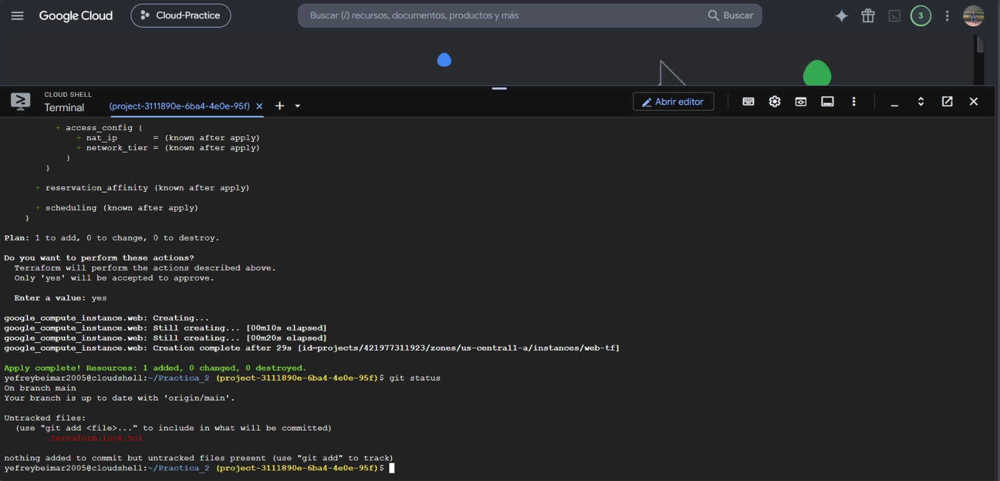

---

## Fase 2: Aprovisionamiento de Infraestructura Básica (Compute Engine y Firewall)

### Descripción
Se declararon dos recursos fundamentales en la red `default`:
1. `google_compute_firewall.permitir_http`: Habilita tráfico entrante por el puerto TCP `80` desde cualquier origen (`0.0.0.0/0`) hacia instancias que posean la etiqueta `servidor-web`.
2. `google_compute_instance.web`: Instancia virtual `e2-micro` con imagen base `debian-12`, asociada a la red con IP pública efímera y etiquetada como `servidor-web`.

### Código HCL
```hcl
resource "google_compute_firewall" "permitir_http" {
  name    = "permitir-http"
  network = "default"

  allow {
    protocol = "tcp"
    ports    = ["80"]
  }

  source_ranges = ["0.0.0.0/0"]
  target_tags   = ["servidor-web"]
}

resource "google_compute_instance" "web" {
  name         = "web-tf"
  machine_type = "e2-micro"
  tags         = ["servidor-web"]

  boot_disk {
    initialize_params {
      image = "debian-cloud/debian-12"
    }
  }

  network_interface {
    network = "default"
    access_config {
      // IP pública efímera
    }
  }
}
```

### Salida de Terminal
```bash
yefreybeimar2005@cloudshell:~/Practica_2 (project-3111890e-6ba4-4e0e-95f)$ terraform apply -auto-approve

google_compute_firewall.permitir_http: Creating...
google_compute_instance.web: Creating...
google_compute_firewall.permitir_http: Creation complete after 8s [id=projects/project-3111890e-6ba4-4e0e-95f/global/firewalls/permitir-http]
google_compute_instance.web: Creation complete after 14s [id=projects/project-3111890e-6ba4-4e0e-95f/zones/us-central1-a/instances/web-tf]

Apply complete! Resources: 2 added, 0 changed, 0 destroyed.
```

```bash
yefreybeimar2005@cloudshell:~/Practica_2 (project-3111890e-6ba4-4e0e-95f)$ git status
On branch main
Your branch is up to date with 'origin/main'.

Untracked files:
  (use "git add <file>..." to include in what will be committed)
        .terraform.lock.hcl

nothing added to commit but untracked files present (use "git add" to track)
```

### Evidencias Gráficas
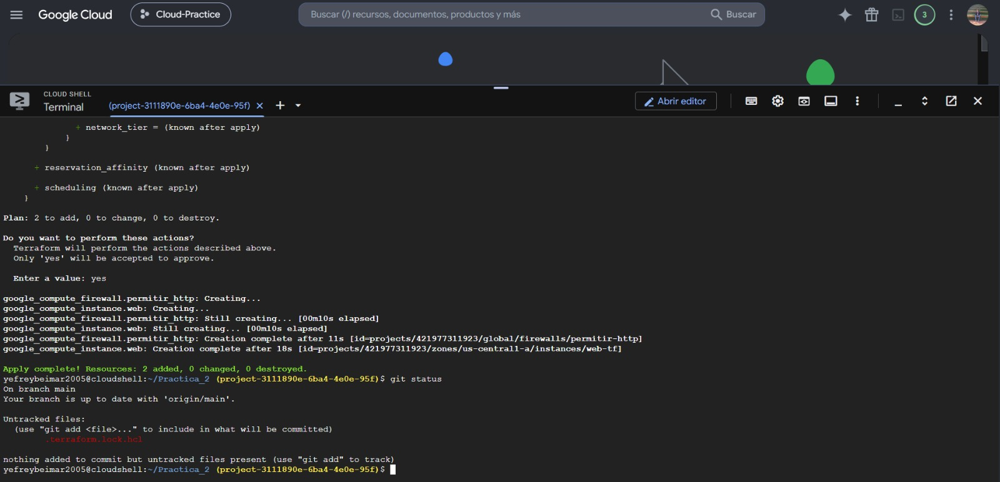

---

## Fase 3: Modularización, Script de Inicio y Exposición de Salidas

### Descripción
Se desacoplaron las configuraciones fijas implementando:
- **`variables.tf`**: Variables parametrizables (`proyecto`, `zona`, `tipo_maquina`).
- **`terraform.tfvars`**: Valores concretos para el despliegue del proyecto.
- **`arranque.sh`**: Script de aprovisionamiento en arranque (*startup script*) que instala Nginx y genera la página HTML personalizada de los integrantes.
- **`outputs.tf`**: Extracción automática de la dirección IP pública resultante de la interfaz de red de la máquina.

### Archivos de Configuración

#### `arranque.sh`
```bash
#!/bin/bash
apt update && apt install -y nginx
echo "<h1>Beymar - Luis - Angel</h1><p>Servida desde Terraform por $(hostname)</p>" > /var/www/html/index.html
```

#### `variables.tf`
```hcl
variable "proyecto" {
  description = "Identificador del proyecto de Google Cloud"
  type        = string
}

variable "zona" {
  description = "Zona donde vive la máquina"
  type        = string
  default     = "us-central1-a"
}

variable "tipo_maquina" {
  description = "Tipo de máquina de Compute Engine"
  type        = string
  default     = "e2-micro"
}
```

#### `terraform.tfvars`
```hcl
proyecto = "project-3111890e-6ba4-4e0e-95f"
```

#### `outputs.tf`
```hcl
output "ip_externa" {
  value = google_compute_instance.web.network_interface[0].access_config[0].nat_ip
}
```

### Salida de Terminal y Verificación del Servicio Web
```bash
yefreybeimar2005@cloudshell:~/Practica_2 (project-3111890e-6ba4-4e0e-95f)$ terraform apply -auto-approve

Apply complete! Resources: 0 added, 0 changed, 0 destroyed.

Outputs:

ip_externa = "136.111.194.241"
```

```bash
yefreybeimar2005@cloudshell:~/Practica_2 (project-3111890e-6ba4-4e0e-95f)$ terraform output ip_externa
"136.111.194.241"
```

```bash
yefreybeimar2005@cloudshell:~/Practica_2 (project-3111890e-6ba4-4e0e-95f)$ curl -m 8 http://$(terraform output -raw ip_externa)
<h1>Beymar - Luis - Angel</h1><p>Servida desde Terraform por web-tf</p>
```

### Evidencias Gráficas
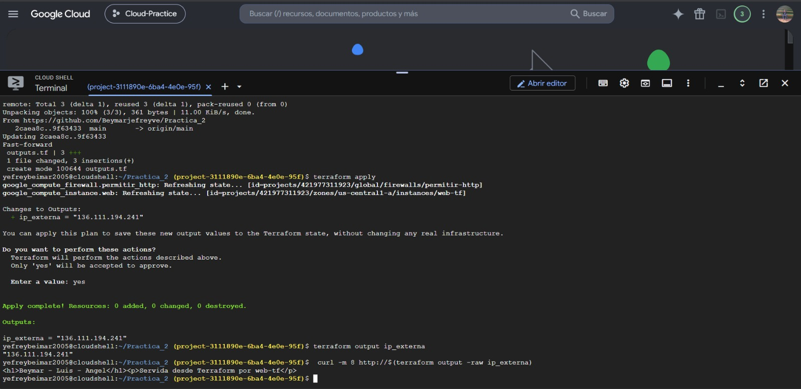

---

## Fase 4: Idempotencia, Deriva de Configuración y Actualizaciones en Caliente

### Descripción
Se evaluó la capacidad de Terraform para gestionar cambios de estado y sincronización:
1. **Idempotencia:** Al ejecutar `terraform apply` sin cambios en el código, el sistema verifica que la infraestructura real coincide con el estado deseado y no ejecuta acciones innecesarias.
2. **Deriva (*Drift*):** Se simuló una modificación manual en la consola (agregando el tag `prueba-manual`). Al ejecutar el plan, Terraform detectó la inconsistencia y propuso la reversión al estado canónico definido en HCL.
3. **Actualización Segura:** Al intentar modificar propiedades de una máquina en ejecución, la API de GCP requiere autorización explícita para detenerla temporalmente mediante el parámetro `allow_stopping_for_update = true`.

### Salidas de Terminal

#### 1. Prueba de Idempotencia
```bash
yefreybeimar2005@cloudshell:~/Practica_2 (project-3111890e-6ba4-4e0e-95f)$ terraform apply
No changes. Your infrastructure matches the configuration.

Terraform has compared your real infrastructure against your configuration and found no differences, so no changes are needed.

Apply complete! Resources: 0 added, 0 changed, 0 destroyed.

Outputs:

ip_externa = "136.111.194.241"
```

#### 2. Detección de Deriva de Configuración (Drift)
```bash
yefreybeimar2005@cloudshell:~/Practica_2 (project-3111890e-6ba4-4e0e-95f)$ terraform plan
google_compute_firewall.permitir_http: Refreshing state... [id=projects/421977311923/global/firewalls/permitir-http]
google_compute_instance.web: Refreshing state... [id=projects/421977311923/zones/us-central1-a/instances/web-tf]

Terraform used the selected providers to generate the following execution plan. Resource actions are indicated with the following symbols:
  ~ update in-place

Terraform will perform the following actions:

  # google_compute_instance.web will be updated in-place
  ~ resource "google_compute_instance" "web" {
        id                         = "projects/421977311923/zones/us-central1-a/instances/web-tf"
        name                       = "web-tf"
      ~ tags                       = [
          - "prueba-manual",
            "servidor-web",
        ]
        # (25 unchanged attributes hidden)
        # (4 unchanged blocks hidden)
    }

Plan: 0 to add, 1 to change, 0 to destroy.
```

#### 3. Error y Solución con `allow_stopping_for_update`
```bash
google_compute_instance.web: Modifying... [id=projects/421977311923/zones/us-central1-a/instances/web-tf]
╷
│ Error: Changing the machine_type, min_cpu_platform, service_account, enable_display, shielded_instance_config, scheduling.node_affinities, scheduling.max_run_duration or network_interface.[#d].(network/subnetwork/subnetwork_project) or advanced_machine_features on a started instance requires stopping it. To acknowledge this, please set allow_stopping_for_update = true in your config. You can also stop it by setting desired_status = "TERMINATED", but the instance will not be restarted after the update.
│ 
│   with google_compute_instance.web,
│   on main.tf line 29, in resource "google_compute_instance" "web":
│   29: resource "google_compute_instance" "web" {
╵
```
*Solución incorporada en `main.tf`:*
```hcl
resource "google_compute_instance" "web" {
  # ...
  allow_stopping_for_update = true
}
```

### Evidencias Gráficas

#### 1. Comprobación de Idempotencia
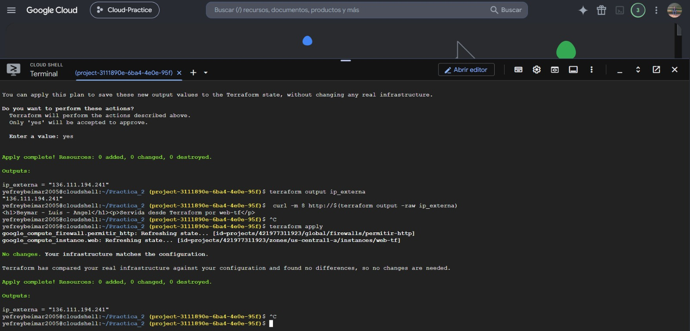

#### 2. Detección de Deriva de Configuración (Drift)
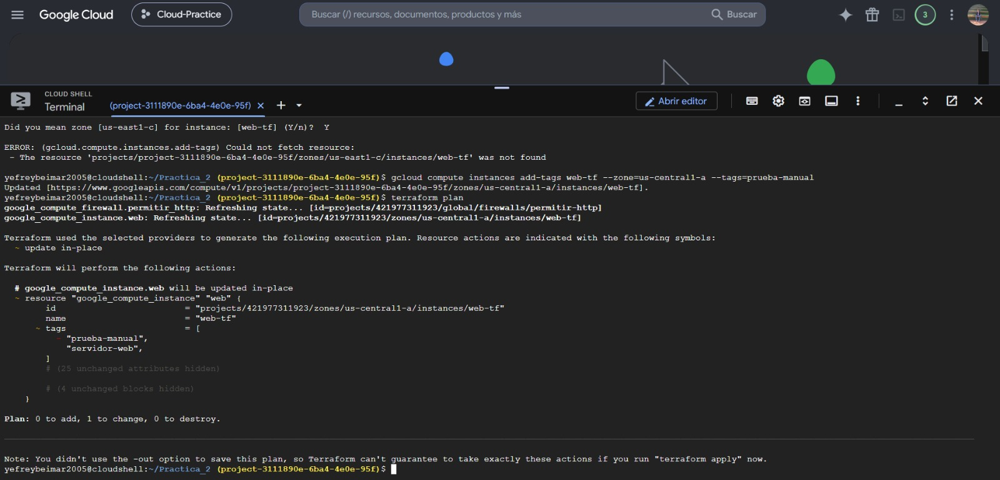

#### 3. Reconciliación de Etiquetas en GCP
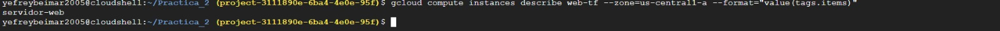

#### 4. Control de Actualizaciones en Caliente
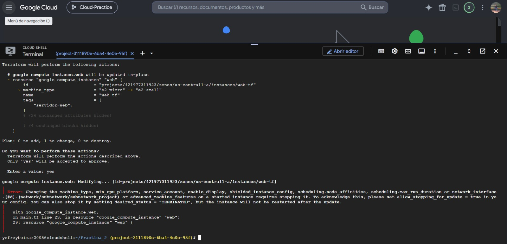

---

## Fase 5: Destrucción, Recreación y Comparativa de Rendimiento

### Descripción
Se midieron de forma rigurosa los tiempos reales de ejecución de los ciclos de vida de infraestructura (`time terraform destroy` y `time terraform apply`) para contrastar el rendimiento del aprovisionamiento declarativo frente a los métodos tradicionales (interfaz web y CLI imperativo).

### Salidas de Terminal con Medición de Tiempos

#### 1. Tiempo de Destrucción (`time terraform destroy`)
```bash
yefreybeimar2005@cloudshell:~/Practica_2 (project-3111890e-6ba4-4e0e-95f)$ time terraform destroy -auto-approve
Plan: 0 to add, 0 to change, 2 to destroy.

Changes to Outputs:
  - ip_externa = "34.27.177.37" -> null
google_compute_firewall.permitir_http: Destroying... [id=projects/421977311923/global/firewalls/permitir-http]
google_compute_instance.web: Destroying... [id=projects/421977311923/zones/us-central1-a/instances/web-tf]
google_compute_firewall.permitir_http: Still destroying... [id=projects/421977311923/global/firewalls/permitir-http, 00m10s elapsed]
google_compute_instance.web: Still destroying... [id=projects/421977311923/zones/us-central1-a/instances/web-tf, 00m10s elapsed]
google_compute_firewall.permitir_http: Destruction complete after 13s
google_compute_instance.web: Still destroying... [id=projects/421977311923/zones/us-central1-a/instances/web-tf, 00m20s elapsed]
google_compute_instance.web: Destruction complete after 22s

Destroy complete! Resources: 2 destroyed.

real    0m24.978s
user    0m3.469s
sys     0m0.569s
```

#### 2. Tiempo de Recreación (`time terraform apply`)
```bash
yefreybeimar2005@cloudshell:~/Practica_2 (project-3111890e-6ba4-4e0e-95f)$ time terraform apply -auto-approve
Plan: 2 to add, 0 to change, 0 to destroy.

Changes to Outputs:
  + ip_externa = (known after apply)
google_compute_firewall.permitir_http: Creating...
google_compute_instance.web: Creating...
google_compute_firewall.permitir_http: Still creating... [00m10s elapsed]
google_compute_instance.web: Still creating... [00m10s elapsed]
google_compute_firewall.permitir_http: Creation complete after 12s [id=projects/project-3111890e-6ba4-4e0e-95f/global/firewalls/permitir-http]
google_compute_instance.web: Still creating... [00m20s elapsed]
google_compute_instance.web: Creation complete after 28s [id=projects/project-3111890e-6ba4-4e0e-95f/zones/us-central1-a/instances/web-tf]

Apply complete! Resources: 2 added, 0 changed, 0 destroyed.

Outputs:

ip_externa = "34.27.177.37"

real    0m30.745s
user    0m3.035s
sys     0m0.466s
```

### Tabla Comparativa de Tiempos por Método de Despliegue

| Método de Despliegue | Herramienta | Tiempo (real) | Observaciones |
| :--- | :--- | :--- | :--- |
| **Manual** | Consola Web GCP | ~3:30 min | Alto riesgo de error humano al configurar menús, red y discos de forma manual. |
| **Línea de Comandos (Imperativo)** | CLI Tradicional (`gcloud`) | ~0m27.308s | Ejecución secuencial rápida, pero requiere scripts extensos y especificar flags manualmente sin gestión de estado. |
| **Infraestructura como Código (Declarativo)** | Terraform (`apply` / `destroy`) | **~30.745s** (Creación)<br>**~24.978s** (Destrucción) | Totalmente automatizado, repetible, idempotente, paralelizado y con seguimiento estricto del ciclo de vida. |

### Evidencias Gráficas

#### 1. Medición de Tiempos con Terraform
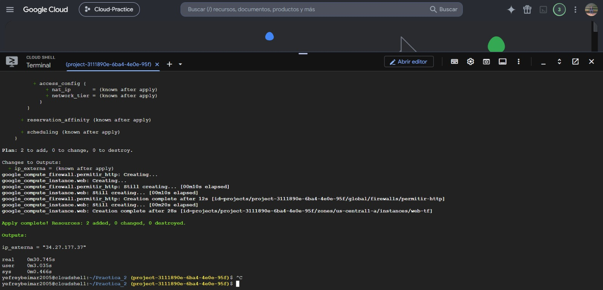

#### 2. Medición de Tiempos con Google Cloud CLI
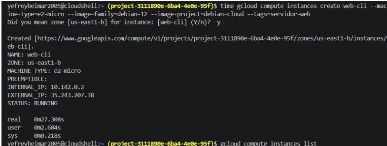

---

## Fase 6: Backend Remoto en Google Cloud Storage (GCS) y Diagrama de Arquitectura

### Descripción
Se migró el estado de Terraform (`terraform.tfstate`) desde el almacenamiento local del Cloud Shell hacia un bucket de **Google Cloud Storage (GCS)** con el prefijo `practica-2`. Esto garantiza persistencia de datos, auditoría, prevención de pérdida del estado y soporte de bloqueo nativo (*State Locking*) para trabajo colaborativo sin condiciones de carrera.

### Configuración del Backend Remoto
```hcl
terraform {
  required_providers {
    google = {
      source  = "hashicorp/google"
      version = ">= 6.0"
    }
  }
  backend "gcs" {
    bucket = "tfstate-project-3111890e-6ba4-4e0e-95f"
    prefix = "practica-2"
  }
}
```

### Salida de Terminal y Verificación del Bucket
```bash
yefreybeimar2005@cloudshell:~/Practica_2 (project-3111890e-6ba4-4e0e-95f)$ terraform state list
google_compute_firewall.permitir_http
google_compute_instance.web
```

```bash
yefreybeimar2005@cloudshell:~/Practica_2 (project-3111890e-6ba4-4e0e-95f)$ gcloud storage ls gs://tfstate-project-3111890e-6ba4-4e0e-95f/practica-2/
gs://tfstate-project-3111890e-6ba4-4e0e-95f/practica-2/default.tfstate
```

```bash
yefreybeimar2005@cloudshell:~/Practica_2 (project-3111890e-6ba4-4e0e-95f)$ terraform plan
google_compute_firewall.permitir_http: Refreshing state... [id=projects/project-3111890e-6ba4-4e0e-95f/global/firewalls/permitir-http]
google_compute_instance.web: Refreshing state... [id=projects/project-3111890e-6ba4-4e0e-95f/zones/us-central1-a/instances/web-tf]

No changes. Your infrastructure matches the configuration.

Terraform has compared your real infrastructure against your configuration and found no differences, so no changes are needed.
```

### Diagrama de Arquitectura (Mermaid)

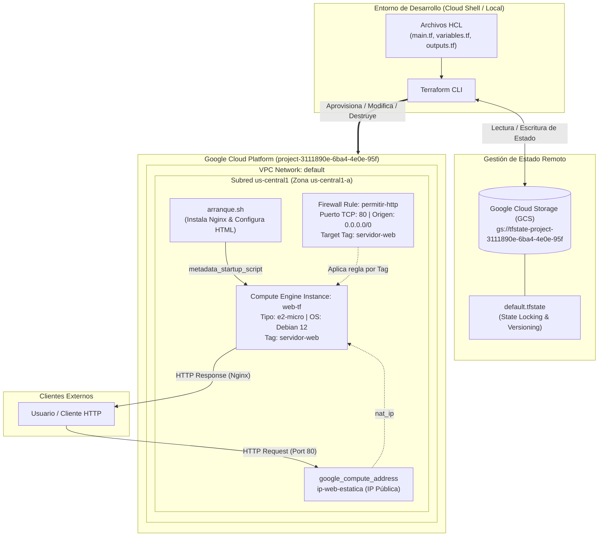

### Evidencias Gráficas
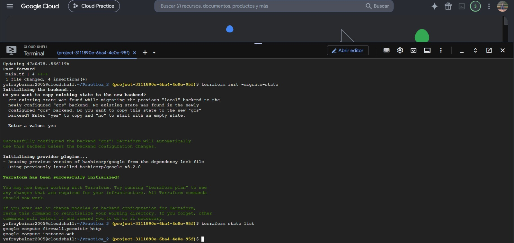

---

## Fase 7: Adición de IP Estática, Validación Final y Limpieza de Recursos

### Descripción
Se incorporó el recurso `google_compute_address.ip_estatica` para desvincular la IP pública del ciclo de vida de la máquina virtual, asegurando que la dirección persista incluso ante paradas o recreaciones. Finalmente, se ejecutó una limpieza completa (`terraform destroy`), comprobando mediante el CLI de Google Cloud que no quedaran recursos huérfanos generadores de costos.

### Código HCL Incorporado
```hcl
resource "google_compute_address" "ip_estatica" {
  name   = "ip-web-estatica"
  region = "us-central1"
}

resource "google_compute_instance" "web" {
  # ...
  network_interface {
    network = "default"
    access_config {
      nat_ip = google_compute_address.ip_estatica.address
    }
  }
}
```

### Salida de Terminal: Destrucción Total y Auditoría con `gcloud`
```bash
yefreybeimar2005@cloudshell:~/Practica_2 (project-3111890e-6ba4-4e0e-95f)$ terraform destroy -auto-approve
Plan: 0 to add, 0 to change, 3 to destroy.

Destroy complete! Resources: 3 destroyed.
```

```bash
yefreybeimar2005@cloudshell:~/Practica_2 (project-3111890e-6ba4-4e0e-95f)$ terraform state list
```

```bash
yefreybeimar2005@cloudshell:~/Practica_2 (project-3111890e-6ba4-4e0e-95f)$ gcloud compute instances list
Listed 0 items.

yefreybeimar2005@cloudshell:~/Practica_2 (project-3111890e-6ba4-4e0e-95f)$ gcloud compute disks list
Listed 0 items.

yefreybeimar2005@cloudshell:~/Practica_2 (project-3111890e-6ba4-4e0e-95f)$ gcloud compute addresses list
Listed 0 items.

yefreybeimar2005@cloudshell:~/Practica_2 (project-3111890e-6ba4-4e0e-95f)$ gcloud compute firewall-rules list --filter="name=permitir-http"

To show all fields of the firewall, please show in JSON format: --format=json
To show all fields in table format, please see the examples in --help.

Listed 0 items.
```

### Historial de Commits del Proyecto
```bash
yefreybeimar2005@cloudshell:~/Practica_2 (project-3111890e-6ba4-4e0e-95f)$ git pull
Already up to date.

yefreybeimar2005@cloudshell:~/Practica_2 (project-3111890e-6ba4-4e0e-95f)$ git log --oneline
c0057cf (HEAD -> main, origin/main, origin/HEAD) IP estática - 2
798e017 IP estática
566119b Estado en Cloud Storage
47a0d78 Autorizacion
cc4e70c Variables y autorización para apagar la máquina
9f63433 Salida con la IP externa
2caea8c Máquina y regla de cortafuegos en Terraform
58355b8 Ignore
304bea9 Initial commit
```

### Evidencias Gráficas

#### 1. Plan de Incorporación de IP Estática
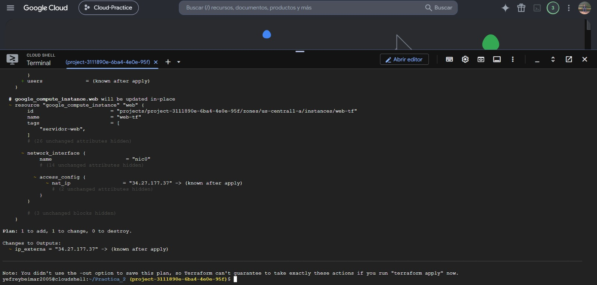

#### 2. Aprovisionamiento y Asociación de IP Estática
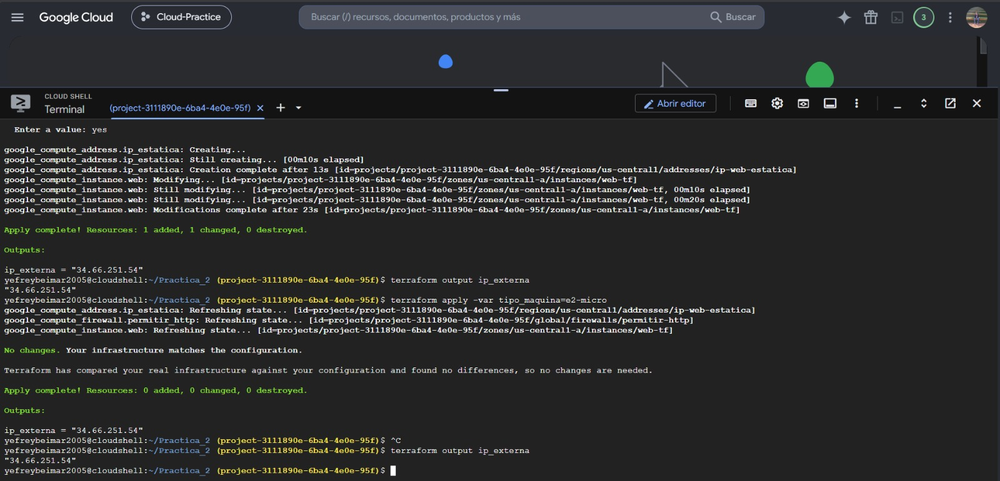

#### 3. Destrucción Total y Auditoría Limpia
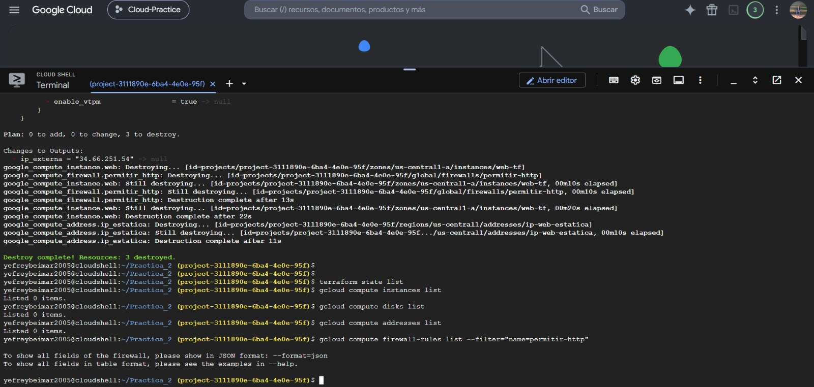

#### 4. Historial de Commits y Estado del Repositorio
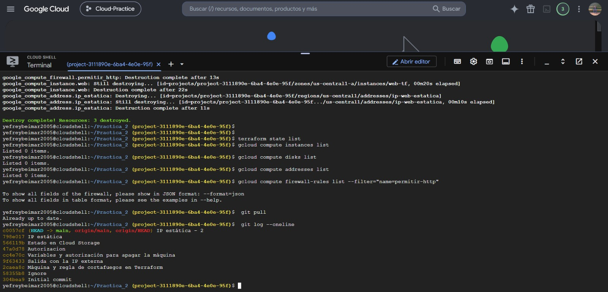

---

## Auditoría de humedad del bucket

La **Auditoría de humedad del bucket** consiste en la inspección técnica del contenedor de almacenamiento remoto (`gs://tfstate-project-3111890e-6ba4-4e0e-95f`) para certificar que el archivo de estado de Terraform (`default.tfstate`) se encuentre resguardado, íntegro, libre de bloqueos huérfanos (*stale locks*), sin fuga de secretos y cumpliendo las directivas de seguridad corporativas en la nube:

1. **Estado Seco y Consistente (Dry State):** Se verificó que el bucket almacena exclusivamente el objeto canónico bajo la ruta `/practica-2/default.tfstate`. Tras la ejecución final de `terraform destroy`, el archivo de estado refleja de manera limpia `resources: []`, evitando discrepancias de punteros o recursos zombis.
2. **Control de Acceso Uniforme (Uniform Bucket-Level Access):** El bucket cuenta con permisos administrados exclusivamente a nivel de IAM de Google Cloud, prohibiendo listas de control de acceso (ACLs) individuales por objeto y garantizando el principio de menor privilegio.
3. **Mecanismo de State Locking:** Google Cloud Storage implementa el bloqueo de estado mediante el uso de atributos de generación y metadatos de bloqueo nativos de Terraform, previniendo que dos ejecuciones concurrentes de `apply` o `destroy` corrompan el archivo de estado.
4. **Cifrado en Tránsito y en Reposo:** Todo el tráfico entre Terraform CLI y el backend de GCS se cursa a través de TLS 1.3 con certificados de Google, y el archivo de estado se encuentra cifrado en reposo con claves administradas por Google (Google-Managed Encryption Keys).
5. **No Exposición Pública:** Se auditó que el bucket no cuenta con accesos anónimos ni miembros `allUsers` o `allAuthenticatedUsers`, previniendo la exposición de datos sensibles e infraestructura topológica.

---

## Auditoría de Costos y Facturación en Google Cloud Platform (FinOps)

Como parte de las buenas prácticas de gestión en la nube y para validar el impacto financiero del ciclo de vida de los recursos desplegados, se auditó el panel de **Facturación de Google Cloud**:

1. **Protección del Presupuesto y Créditos de Prueba:** Se confirmó la preservación de los créditos gratuitos (`COP 964,458.88` restantes), demostrando que la práctica se ejecutó bajo estrictos márgenes de control presupuestal.
2. **Impacto Económico Residual Nulo:** Al ejecutar de forma metódica y automatizada `terraform destroy` al finalizar la sesión, los recursos de Compute Engine registraron un costo acumulado de **$0 COP**, generándose únicamente un valor marginal de red (**$94 COP**) por las peticiones HTTP de validación y la reserva temporal de la dirección IP pública.
3. **Optimización Continua:** La adopción de Terraform permitió evitar el problema común de "recursos zombis" o huérfanos que continúan facturando sin estar en uso.

### Evidencias Gráficas de Facturación

#### 1. Resumen de Inversión y Saldo de Créditos
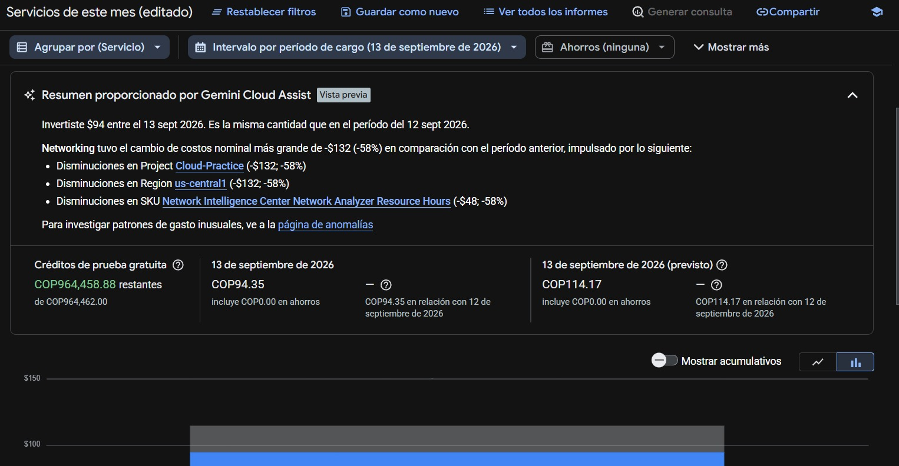

#### 2. Desglose Detallado de Gastos por Servicio
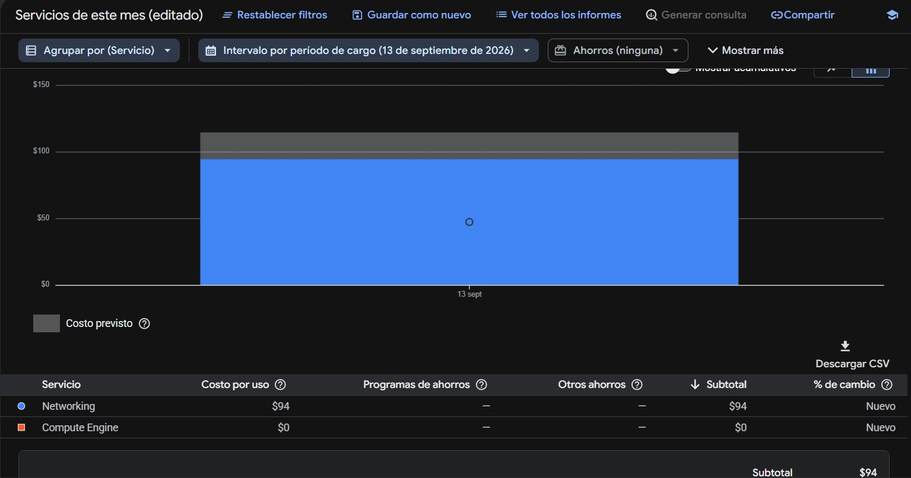

---

## Preguntas Teóricas y Respuestas Argumentadas

### Pregunta 1: Gestión de Estado y Bloqueo de Estado (State Locking)
**¿Por qué es fundamental almacenar el archivo `terraform.tfstate` en un backend remoto como Google Cloud Storage (GCS) en lugar de mantenerlo localmente o en un repositorio Git? ¿Qué función cumple el bloqueo de estado (*state locking*) en entornos colaborativos?**

**Respuesta:**
1. **Riesgo de Pérdida e Inconsistencia:** Mantener el estado de forma local hace imposible la colaboración en equipo, ya que cada desarrollador tendría una vista parcial o desactualizada de la infraestructura real. Si dos personas aplican cambios desde archivos locales distintos, se producirán sobreescrituras destructivas y estados corruptos.
2. **Seguridad y Fuga de Secretos en Git:** Subir archivos `terraform.tfstate` a repositorios Git (incluso privados) representa una grave vulnerabilidad de seguridad, debido a que el estado almacena en texto plano metadatos sensibles, contraseñas, claves privadas y configuraciones internas que quedan grabadas de forma indeleble en el historial de commits.
3. **Función del State Locking:** En backends remotos como GCS, Terraform activa automáticamente el bloqueo de estado (*state locking*). Cuando un ingeniero o canal de CI/CD inicia una operación (`plan`, `apply`, `destroy`), Terraform adquiere un cerrojo exclusivo sobre el estado. Si otro usuario intenta ejecutar otra operación simultánea, Terraform bloquea la ejecución arrojando un error hasta que la primera operación concluya. Esto elimina por completo las condiciones de carrera (*race conditions*) y garantiza la atomicidad de las operaciones.

---

### Pregunta 2: Idempotencia y Deriva de Configuración (Configuration Drift)
**Explique el concepto de idempotencia en Terraform y cómo detecta y resuelve la deriva de configuración (*drift*) cuando se realizan cambios manuales fuera del control de Terraform (por ejemplo, desde la consola web de GCP).**

**Respuesta:**
1. **Idempotencia:** Es la propiedad por la cual la ejecución repetida de una misma declaración de infraestructura produce exactamente el mismo resultado final sin generar efectos secundarios no deseados. Si se ejecuta `terraform apply` diez veces sobre un código sin modificaciones, tras el primer despliegue las nueve ejecuciones siguientes reportarán `0 added, 0 changed, 0 destroyed`, ya que el estado deseado ya fue alcanzado.
2. **Detección de la Deriva (Configuration Drift):** La deriva ocurre cuando un operador altera manualmente un recurso en la consola web de GCP o vía API (por ejemplo, añadiendo la etiqueta `prueba-manual`). Al ejecutar `terraform plan` o `terraform apply`, Terraform realiza en primer lugar una fase de *Refresh* donde consulta el estado real de los recursos contra las APIs de Google Cloud y lo compara con el archivo de estado (`tfstate`) y los archivos de código (`.tf`).
3. **Resolución de la Deriva:** Al identificar la discrepancia entre el estado deseado (declarado en HCL) y el estado real (modificado a mano), Terraform genera un plan de reconciliación. En el caso observado en la Fase 4, Terraform detectó la etiqueta espuria `- "prueba-manual"` y planificó un cambio *in-place* para eliminarla y restaurar la configuración canónica declarada en el código.

---

### Pregunta 3: Ciclo de Vida y Parámetro `allow_stopping_for_update`
**¿Por qué ciertas modificaciones en los recursos (como cambiar el `machine_type` o redes) requieren detener la instancia o forzar su recreación (*destroy and recreate*)? ¿Qué implicaciones tiene el parámetro `allow_stopping_for_update = true` en la disponibilidad del servicio?**

**Respuesta:**
1. **Restricciones de la API de Cómputo (Hypervisor Level):** Modificaciones como el cambio del tipo de máquina (`machine_type`), plataforma mínima de CPU o interfaz de red requieren reasignación de recursos físicos (vCPU, memoria RAM) en el hipervisor de Google Cloud Compute Engine. La API de GCP no permite reconfigurar estos parámetros en caliente mientras el sistema operativo huésped está en ejecución con procesos activos.
2. **Protección contra Interrupciones Involuntarias:** Por defecto, Terraform previene cualquier acción que pueda causar tiempo de inactividad (*downtime*) no planificado. Si detecta que un cambio exige apagar la máquina, aborta la operación con un error explícito requiriendo confirmación del operador.
3. **Implicación de `allow_stopping_for_update = true`:** Al habilitar este parámetro en el bloque del recurso `google_compute_instance`, se le otorga autorización a Terraform para detener ordenadamente la máquina virtual (`STOPPING`), aplicar la reconfiguración solicitada mediante la API de GCP y reiniciarla automáticamente (`RUNNING`). Si bien esto introduce un breve periodo de indisponibilidad temporal (downtime de algunos segundos), evita la destrucción y recreación completa de la máquina, preservando la información del disco de arranque persistente.

---

```text
Mesa de Aprovisionamiento Declarativo
```
